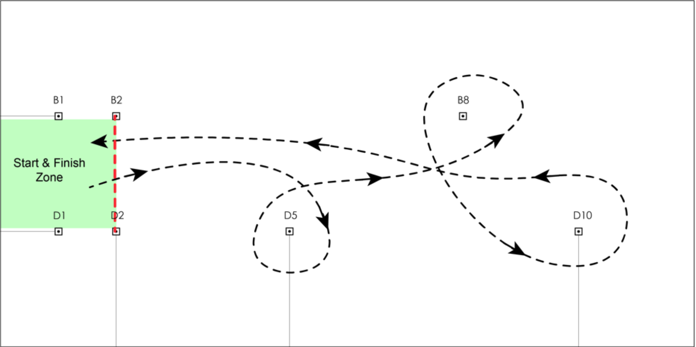
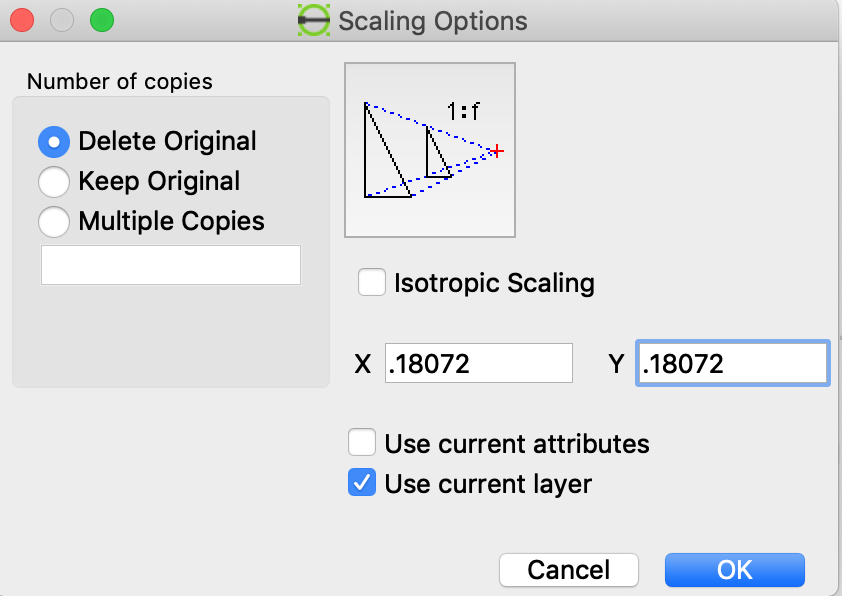
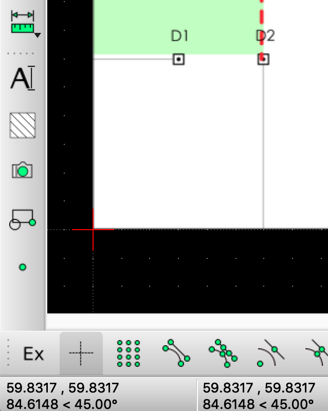
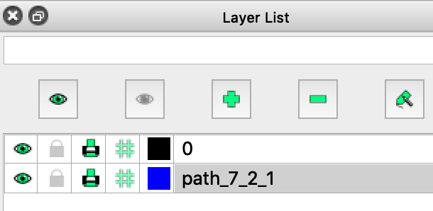
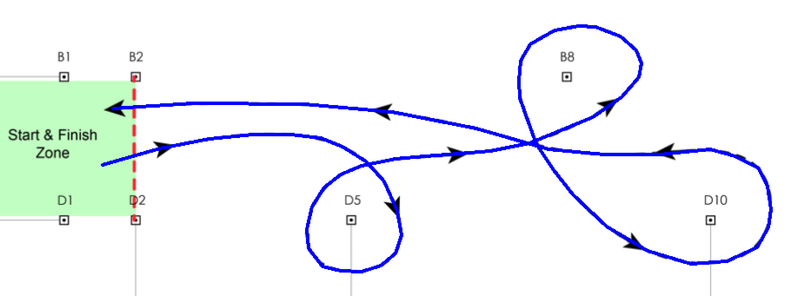

How to create a path for frc

1) Install LibreCad  https://librecad.org/
2) Get an image of  the playing field or a path that you want to trace. Do this with a screenshot. To make things easier, try to get 0,0 as the bottom left hand corner of the image.

3) Set the units of the drawing (options->current drawing preferences->main drawing unit) to be the units used for robot navigation. For example, if you pass inches into drive straight, set units to inches. If you pass mm into drive straight, set units to mm.
4) If you didn’t make the bottom left hand corner of the image the (0,0) of the axes, you are going to have to move the image with a tools->modify->move/copy command. Hopefully you created the image with (0,0) as the bottom left corner of the image so you can skip this step. If you do have to move the image, there is a bug in librecad for mac, so you may not see the change immediately after the move. Save the file, close it, and re-open it and you will see it. If (0,0) is the bottom left corner of the image, you can skip this step entirely.
5) Now you have to scale the image to make it match the units of the drawing. Move the cursor to a known position on the image. For example, on the above image, it is known that D2 is at 5 feet x, 5 feet y. When you move the cursor over that point, there will be coordinates displayed in the bottom left hand corner of the screen. They are displayed in the units the drawing was set to. So if the drawing is set to inches, 5 feet would be 60 and 60. If the coordinates displayed are larger than 60, the image needs to be scaled down so the image matches the units of the drawing. Divide the number you know the point really is by the number reported when the cursor is over the point. So, if you have the cursor over the point and the number displayed is 332, 60/332 = 0.18072.     
6) Select the image and then select tools->modify scale.
7) You will be asked to select a reference point. Select the bottom left hand corner, which should already be at (0,0), which is why we made sure that is where the start of the image was. Then enter the number calculated in step 4 as the scaling factor.

8) Select ok
9) There is a bug in the Mac version of LibreCad so you may not see the immediate results of the scaling after ok has been selected. Save the drawing, close it, and reopen it and now you should see the properly scaled image.
10) Now if you move the cursor over the known point, it should show the actual coordinates of that location in the units the drawing is set to. So if you move the cursor over d2, it should be (60,60), or close to it.

11) Create a new layer called Path. This is optional, but keeps things neat. Use the greeni plus sign under layer list to create a new layer. You can change the layer color and line width too if you want, but that is also optional.

12) Make sure the new layer is selected, because the selected layer is where the drawing/lines will be placed. By having two layers you will be able to turn the view of the image off and just see the path, or vice versa.
13) Select the 2 points line drawing tool from the left side menu.

14) Now, you can just draw the path you want the robot to travel on the display. In this example, I just trace the example path exactly. Just draw straight lines as needed to try to duplicate the path. You can create any path you want though.

15) Save the file. It will be saved as a dxf file.
16) Get conversion code from https://github.com/aurle/path_maker
17) The file you want here is dxf2frc.cpp
18) Run make to build it, or build it with g++ -o dxf2frc dxf2frc.cpp (I already put a binary in the 2021 programming folder but you should probably build from source just in case any updates were pushed to git)
19) Make it executable with chmod a+x dxf2frc
20) Generate commands for the path with ./dxf2frc filename.dxf  where filename.dxf is the name of the file you saved in librecad.
21) This will generate the drive straight and rotate commands needed to follow the path you drew. Output will look something like this.
./dxf2frc layouts.dxf 

drive straight 25.961510:  
rotate 4.332321 

drive straight 20.396078:  
rotate 4.969734 

drive straight 18.110771:  
rotate 6.340195 

drive straight 16.000000:  
rotate 9.462318 

drive straight 12.165525:  
rotate 8.972633 

drive straight 9.486833:  
rotate 16.557068 

drive straight 12.206555:  
rotate 10.007980 

drive straight 11.313708:  
rotate 22.380142 

drive straight 13.000000:  
rotate 16.909271 

drive straight 10.049875:  
rotate 19.746826 

drive straight 8.246211:  
rotate 36.158188 

drive straight 7.810250:  
rotate 25.769318 

